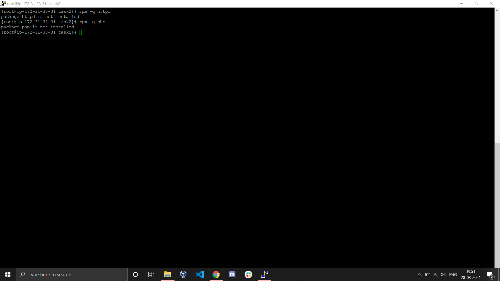
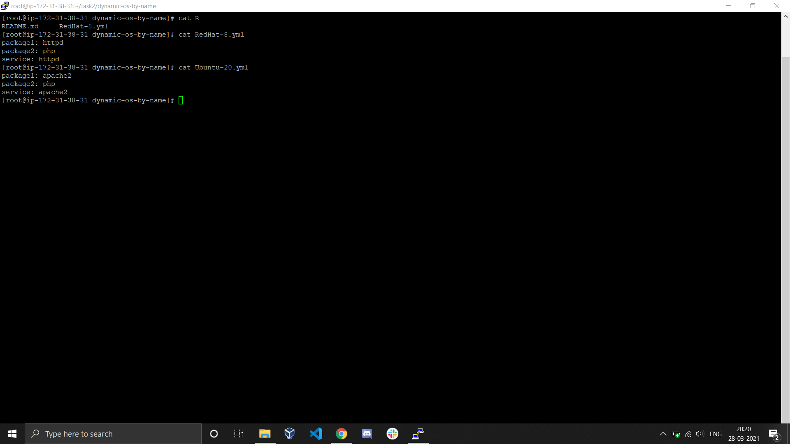
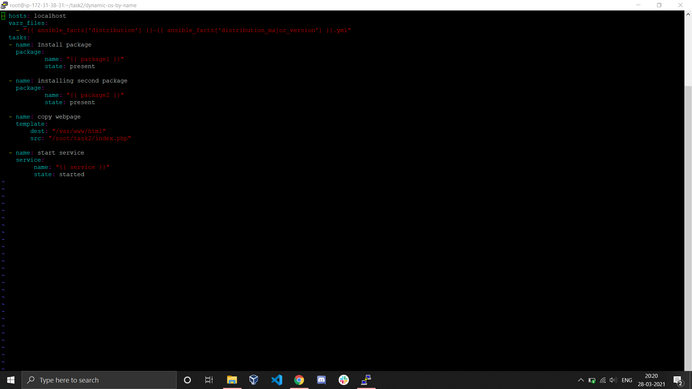
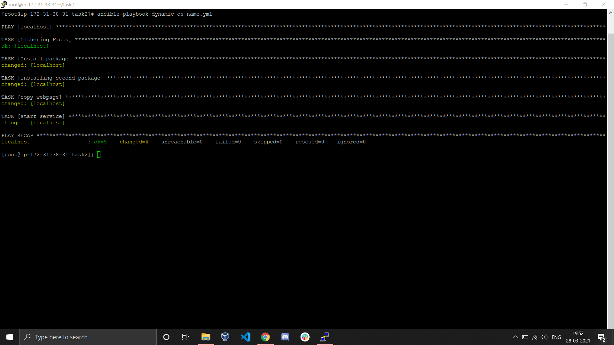
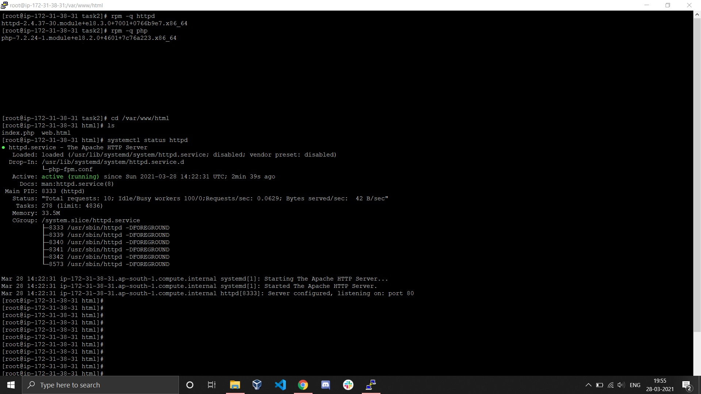

# Configuring Managed Node Using File Name Same as OS Name

## Description

In this project we configure ansible managed node using playbook. In the playbook we use variables and these variables are declared in a var_file. 
The var_files include variables like package names, service name etc. and are named after some os. 

When we run the playbook it retrieves the os of the managed nodes and based on the os the specific var_files are loaded. So that managed node is configured with the packages and have services started as specified in those var_file. We create different var_files for different os and each var_file has different packages and services.

In this project we have created two variable files named RedHat-8 and Ubuntu-20. Both these files contain name of packages and services. We use those variable names in our playbook. 
If the managed node is RedHat then the variables of RedHat-8.yml will be loaded and if it is Ubuntu then variables of Ubuntu-20.yml are loaded. 

## Theory 

Ansible is a declarative language. We tell ansible what we want to do and ansible figures on it's own how to do it. For this ansible goes to the managed node and explores the node. 
It retrieves all the data regarding the node and based on this data it takes appropriate steps. This collection of data is called facts. The first step when any playbook is run is facts collection. 

We use these facts for automating the configuration process without using *when* keyword. 

We retrieve the os name using the facts and as we already have var_file name same as os name it will load that file and all it's variables. 

Based on different os different var_files will be loaded and different packages and services will be configured in different nodes. 

## Steps

First we figure out what we want to configure in which nodes. Here we are installing httpd and php if the os is Redhat and apache2 and php if os is Ubuntu. 

### Initially the packages httpd and php are not installed in the localhost


Now we create two files named RedHat-8.yml and Ubuntu-20.yml and in these files we specify the name of the packages and services. 



We create a playbook. This playbook will load the var_file named same as os name using facts. 



To run the playbook:
```bash
ansible-playbook dynamic_os_name.yml
```



### Here we run the playbook in localhost so the var_file Redhat-8.yml is loaded and packages php and httpd are installed and service httpd is started. 


